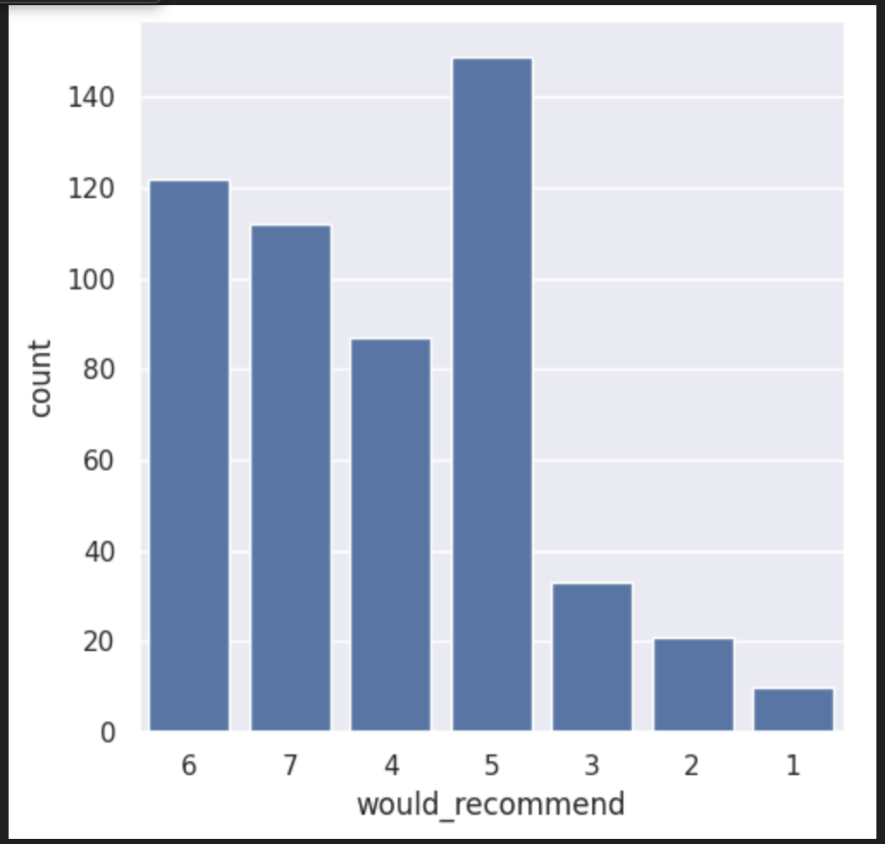
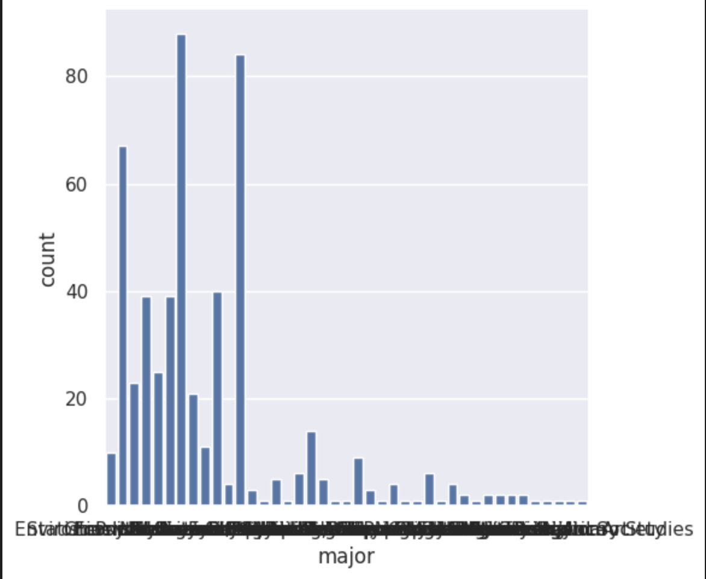
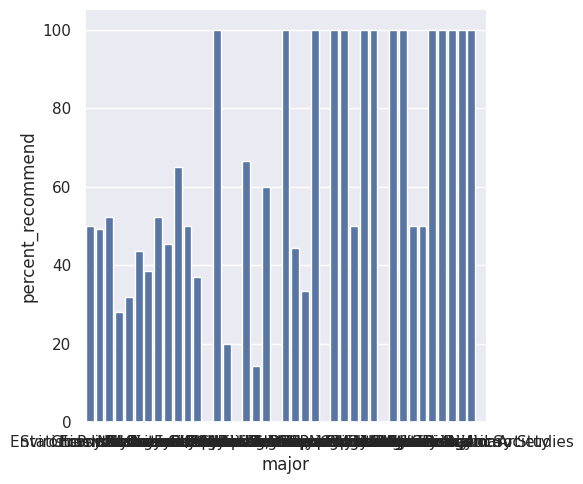

---
# Do not edit the text between these lines!
layout: default
---

# COMP 110 Student Recommendation Analysis

## Overview
This project analyzes whether students from different majors are equally likely to recommend COMP 110. Understanding these differences can help improve the course for a wider range of students across different majors.

We used survey data and focused on two columns: major and would_recommend

We defined “would recommend” as a score of 6 or 7 on the 1–7 scale used in the survey.

We created a helper function to calculate the percentage of students who would recommend Comp 110 to other students for each major.

## Results 
1. Recommendation rates differ greatly across majors
2. Data Science and Computer Science had higher  recommendation rates (60-65%)
3. Psychology and Environmental Science had low recommendation rates (28-32%)
4. Several majors had a sample size too small to be analyzed  

## Visualizations

### Distribution of Recommendation Scores

### Number of Responses by Major

### Percent Recommending by Major

## Conclusion
Students from different majors experience COMP 110 differently. While some majors benefit a lot, others may not find the course as relevant or may not like the way it is taught, causing them to not recommend the course as strongly.

One limitation is that some majors had very few responses, leading to extreme values like 0% or 100%.

A useful next step would be to group majors or filter out small sample sizes to address the limitation. 

## Recommendation
COMP 110 should incorporate examples from a wider variety of majors to better support the variety of studnets.